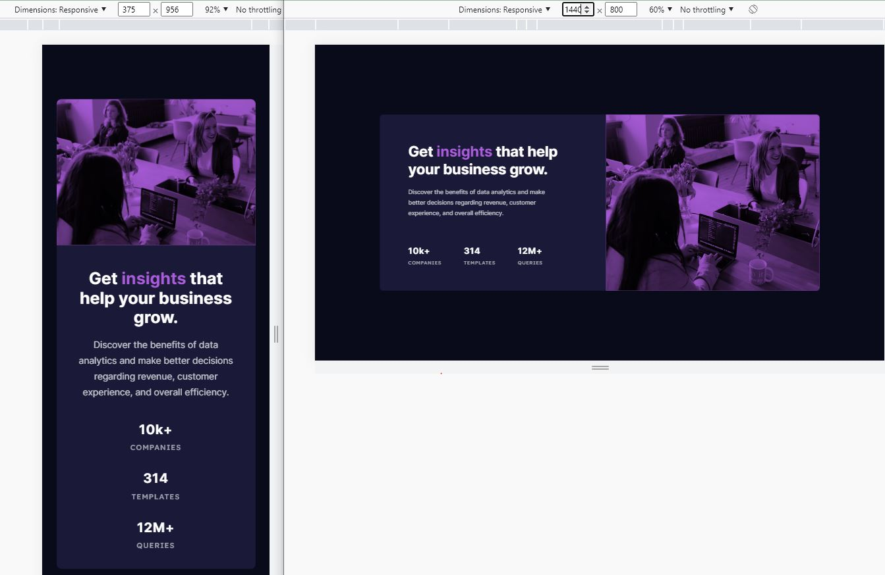

# Frontend Mentor - Stats preview card component solution

This is a solution to the [Stats preview card component challenge on Frontend Mentor](https://www.frontendmentor.io/challenges/stats-preview-card-component-8JqbgoU62).

## Table of contents

- [Overview](#overview)
  - [The challenge](#the-challenge)
  - [Screenshot](#screenshot)
  - [Links](#links)
- [My process](#my-process)
  - [Workflow]()
  - [Built with](#built-with)
  - [What I learned](#what-i-learned)
  - [Continued development](#continued-development)
  - [Useful resources](#useful-resources)
- [Author](#author)
- [Acknowledgments](#acknowledgments)

## Overview

### The challenge

Users should be able to:

- View the optimal layout depending on their device's screen size

### Screenshot

### Links

- Solution: [frontendmentor.io](https://your-solution-url.com)
- Live Site: [github.io](https://siavhnz.github.io/frontendmentor/7.stats-preview-card/index.html)

## My process

### Workflow
 - Set up the project folder structure
 - Set up the project with Git
 - Set up Tailwindcss
 - Create HTML Skeleton based on mobile design `assets/design/mobile-design.jpg`
 - Work on mobile desing
 - Work on desktop desing
 - Write README.me
 - publish on github.io | github.com | frontendmentor.io

### Built with

- Semantic HTML5 markup
- Mobile-first workflow
- Tailwindcss
- Flexbox
- CSS Grid

### What I learned

I learned how to use `mix-blend-mode` for an image and `grid-template-columns: 1fr auto;` for creating a layout; auto value makes the parent tag a function of its children and grows as its children size.

### Continued development

Flexbox, Grid, and Tailwindcss are my practice area in further challenges.

### Useful resources

- [Grid](https://developer.mozilla.org/en-US/docs/Learn/CSS/CSS_layout/Grids)

- [mix-blend-mode](https://developer.mozilla.org/en-US/docs/Web/CSS/mix-blend-mode)

## Author

- Frontend Mentor - [@siavhnz](https://www.frontendmentor.io/profile/siavhnz)

## Acknowledgments

[Frontendmentor.io](https://www.frontendmentor.io/challenges) - for their Excitement challenges  

[Perfect Pixel](https://chrome.google.com/webstore/detail/perfectpixel-by-welldonec/dkaagdgjmgdmbnecmcefdhjekcoceebi?hl=en) - for such a great extension

[Tailwindcss](https://tailwindcss.com/) - for making CSS easy
